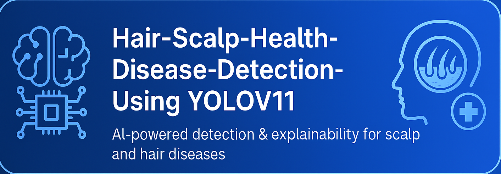
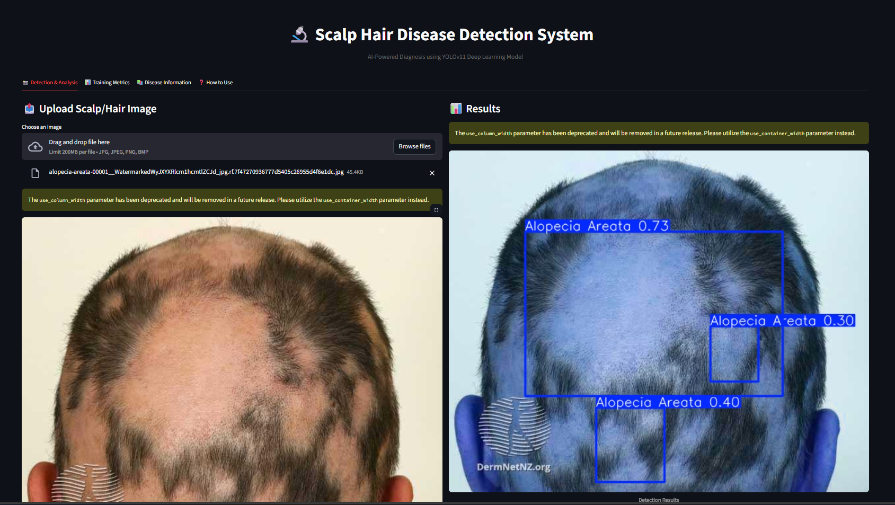
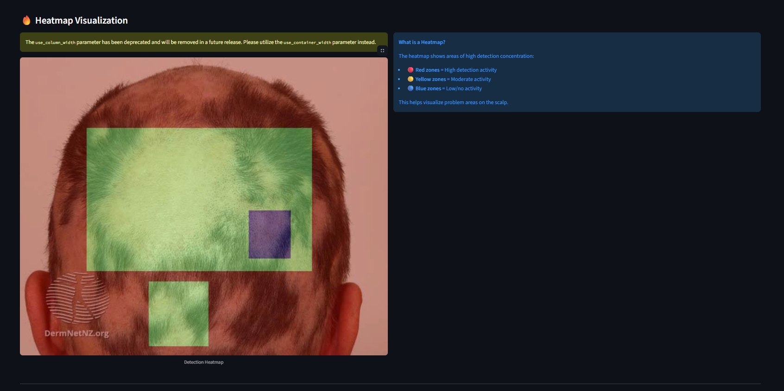
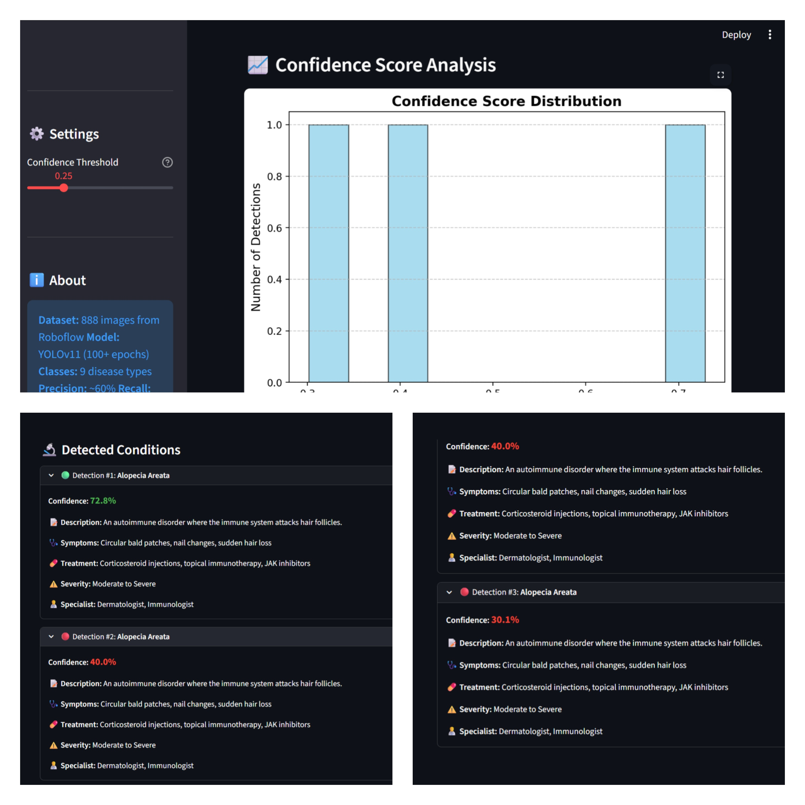
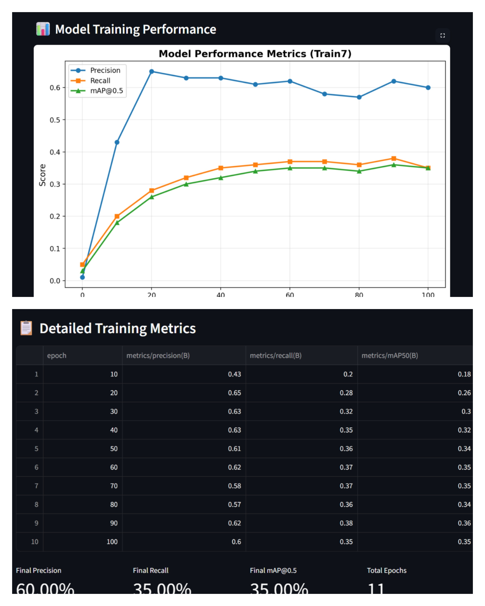

<h1 align="center"> Scalp Hair Disease Detection System</h1>
<p align="center">
  <b>AI-powered diagnosis & explainability for scalp and hair disorders using YOLOv11</b>
</p>

<h2 align="center">
  
</h2>

<p align="center">
  
  
  
  
</p>

---

## Overview
**Hair-Scalp-Health-Disease-Detection-Using-YOLOV11** is a deep learning–powered medical AI application that performs **real-time scalp and hair disease detection from clinical images**, providing:

✔ Bounding-box predictions  
✔ Confidence scores  
✔ Explainable AI heatmaps (XAI)  
✔ Clinical information (disease description, symptoms, treatment, specialists)

Built using **YOLOv11 + Streamlit**, this system demonstrates how AI can support **learning, screening, and dermatology research**.

> ⚠ **Disclaimer:** This project is for educational and research purposes only — not a substitute for professional diagnosis.

---

## Features
| Feature Category | Capability |
|------------------|------------|
| Disease Detection | Real-time localization using YOLOv11 |
| Medical Classes | 9 conditions (Alopecia, Dandruff, Psoriasis, Folliculitis, etc.) |
| Explainability | Grad-CAM heatmap visualization |
| Training Metrics | Precision, Recall, mAP, Loss curves |
| Confidence Analysis | Confidence score distribution plots |
| Clinical Context | Symptoms, treatments, severity & recommended specialists |

---

## UI & Output Showcase
| Detection Results | Heatmap Visualization |
|------------------|----------------------|
|  |  |

| Confidence Score Plot | Training Metrics |
|-----------------------|------------------|
|  |  |

---

## Project Folder Structure
> Below is the complete repository layout for developer reference:

```bash
Scalp-Hair-Disease-Detection/
│
├── app_streamlit.py                # Main Streamlit application (recommended)
├── app_flask.py                    # Flask interface (optional)
├── app_gradio.py                   # Gradio interface (optional)
│
├── requirements.txt                # Python dependencies
├── data.yaml                       # YOLO dataset configuration
│
├── runs/
│   └── detects/
│       └── train7/
│           ├── weights/
│           │   └── best.pt         # Trained YOLOv11 model weights
│           └── results.csv         # Training performance logs
│
├── templates/                      # Flask HTML templates
│
├── train/                          # Training dataset folder
├── test/                           # Testing dataset folder
├── valid/                          # Validation dataset folder
│
├── README.dataset.txt              # Dataset documentation
├── README.roboflow.txt             # Notes from dataset export
│
├── images/                         # Banner & README screenshots
│   ├── banner.png
│   ├── ui_detection_results.png
│   ├── ui_heatmap.png
│   ├── ui_confidence_plot.png
│   └── training_metrics.png
│
└── README.md                       # Project documentation
```

## Installation & Setup

```bash
git clone (https://github.com/Hari0990/Hair-Scalp-Health-Disease-Detection-Using-YOLOV11)
pip install -r requirements.txt
streamlit run app_streamlit.py
